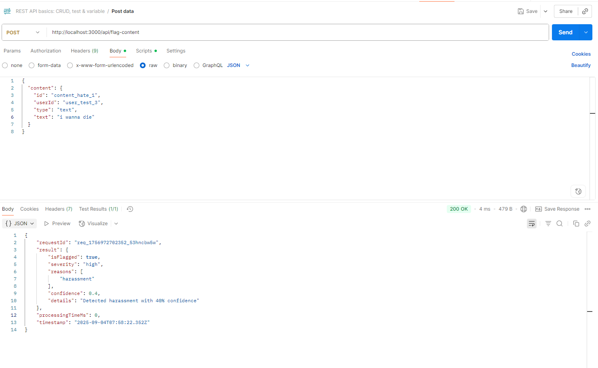

# Content Flagging System

A TypeScript-based content flagging system designed to identify problematic content before it gets posted to social media platforms.

## Features

- Identifies spam, hate speech, harassment, violence, adult content, misinformation, phishing, and personal information exposure
- Low, medium, high, and critical severity classifications
- Considers platform, audience, and user history for more accurate flagging
- Clean HTTP API with single and batch processing endpoints
- Full test coverage with unit and integration tests
- Built with TypeScript for robust type checking

## Quick Start

### Installation

```bash
# Clone the repository
git clone <repository-url>
cd blotato-content-flagging

# Install dependencies
npm install

# Build the project
npm run build

# Start the server
npm start
```

## API Usage



### Health Check

```bash
curl http://localhost:3000/health
```

### Flag Single Content

```bash
curl -X POST http://localhost:3000/api/flag-content \
  -H "Content-Type: application/json" \
  -d '{
    "content": {
      "id": "content_1",
      "userId": "user_1",
      "type": "text",
      "text": "CLICK HERE FOR FREE MONEY!!!"
    },
    "context": {
      "platform": "twitter",
      "audience": "general"
    }
  }'
```

### Flag Multiple Content (Batch)

```bash
curl -X POST http://localhost:3000/api/flag-content/batch \
  -H "Content-Type: application/json" \
  -d '{
    "requests": [
      {
        "content": {
          "id": "content_1",
          "userId": "user_1",
          "type": "text",
          "text": "Clean content"
        }
      },
      {
        "content": {
          "id": "content_2",
          "userId": "user_2",
          "type": "text",
          "text": "CLICK HERE FOR FREE MONEY!!!"
        }
      }
    ]
  }'
```

### Get Supported Flag Reasons

```bash
curl http://localhost:3000/api/flag-reasons
```

## API Reference

### POST /api/flag-content

Flags a single piece of content for problematic patterns.

**Request Body:**
```typescript
{
  content: {
    id: string;           // Unique content identifier
    userId: string;       // User who created the content
    type: 'text' | 'image' | 'video' | 'link';
    text?: string;        // Text content to analyze
    url?: string;         // URL to analyze
    metadata?: object;    // Additional metadata
  };
  context?: {
    platform?: string;    // Social media platform
    audience?: string;    // Target audience
    previousFlags?: number; // User's previous flag count
  };
}
```

**Response:**
```typescript
{
  requestId: string;
  result: {
    isFlagged: boolean;
    severity: 'low' | 'medium' | 'high' | 'critical';
    reasons: string[];
    confidence: number;   // 0-1 scale
    details?: string;
  };
  processingTimeMs: number;
  timestamp: string;
}
```

### POST /api/flag-content/batch

Processes multiple content flagging requests in a single API call (max 100 requests).

### GET /api/flag-reasons

Returns a list of all supported content flagging reasons.

### GET /health

Health check endpoint for monitoring.

## Content Categories

The system detects the following types of problematic content:

- **Spam**: Repetitive content, excessive caps, suspicious URLs, promotional language
- **Hate Speech**: Discriminatory language, slurs, targeted harassment
- **Harassment**: Threats, intimidation, personal attacks
- **Violence**: Explicit violence, weapon references, threats of harm
- **Adult Content**: Sexual content, explicit material
- **Misinformation**: Conspiracy theories, false medical claims, fake news
- **Phishing**: Urgency tactics, account verification scams, suspicious links
- **Personal Information**: SSNs, phone numbers, emails, credit card numbers
- **Copyright Violation**: (Framework ready for implementation)
- **Malware**: (Framework ready for implementation)

## Algorithm Design

The content flagging algorithm uses a multi-layered approach:

1. **Pattern Matching**: Regular expressions detect known problematic patterns
2. **Confidence Scoring**: Each detection is assigned a confidence score (0-1)
3. **Context Adjustment**: Platform, audience, and user history influence scoring
4. **Severity Classification**: Content is classified by severity level
5. **Multi-reason Detection**: Content can be flagged for multiple reasons

### Severity Levels

- **Low**: Minor violations (spam, inappropriate language)
- **Medium**: Moderate violations (adult content, misinformation)
- **High**: Serious violations (hate speech, harassment, phishing)
- **Critical**: Severe violations (violence, malware)

## Testing

The project includes comprehensive test coverage:

- **Unit Tests**: Test individual functions and algorithms
- **Integration Tests**: Test API endpoints and request/response flows
- **Pattern Tests**: Verify pattern matching accuracy
- **Edge Case Tests**: Handle boundary conditions and error cases

Run tests with:
```bash
npm run test
```

## Architecture

```
src/
├── types.ts              # TypeScript type definitions
├── patterns.ts           # Content detection patterns
├── content-flagging.ts   # Core flagging algorithm
├── server.ts            # Express.js API server
├── index.ts             # Application entry point
└── *.spec.ts           # Test files
```

## Performance

- **Single Request**: < 10ms average processing time
- **Batch Processing**: Up to 100 requests per batch
- **Memory Efficient**: Minimal memory footprint
- **Scalable**: Stateless design supports horizontal scaling
